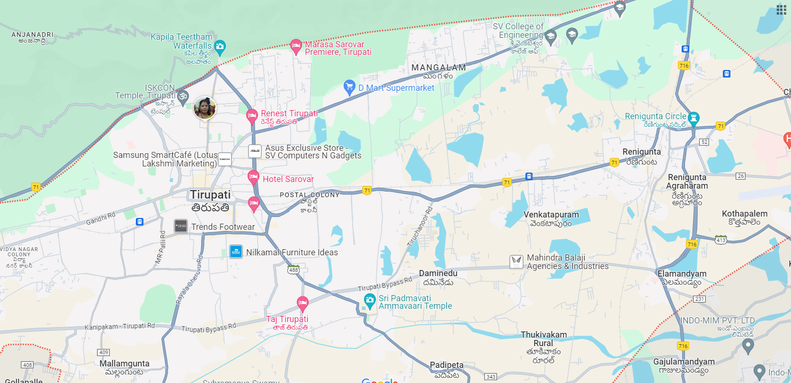

# Ex04 Places Around Me
## Date:22-03-2024 

## AIM
To develop a website to display details about the places around my house.

## DESIGN STEPS

### STEP 1
Create a Django admin interface.

### STEP 2
Download your city map from Google.

### STEP 3
Using ```<map>``` tag name the map.

### STEP 4
Create clickable regions in the image using ```<area>``` tag.

### STEP 5
Write HTML programs for all the regions identified.

### STEP 6
Execute the programs and publish them.

## CODE
```
map.html

<html>
<head>
<title>MAP</title>
</head>
<body bgcolor="lavender">
    <h1 align="center" >TIRUPATI</h1>
    <h2 align="center" >KALIKIRI VAISHNAVI - 212223040081</h2>
   <center>
    
    <map name="image-map">
        <area target="" alt="KAPILA TEERTHAM WATERFALLS" title="KAPILA TEERTHAM WATERFALLS" href="waterfalls.html" coords="460,117,23" shape="circle">
        <area target="" alt="HOTEL TAJ TIRUPATI" title="HOTEL TAJ TIRUPATI" href="hotel.html" coords="637,662,19" shape="circle">
        <area target="" alt="SRI PADMAVATI DEVI TEMPLE" title="SRI PADMAVATI DEVI TEMPLE" href="temple.html" coords="780,652,35" shape="circle">
        <area target="" alt="SV COLLEGE OF ENGINEERING" title="SV COLLEGE OF ENGINEERING" href="college.html" coords="1159,95,51" shape="circle">
        <area target="" alt="ISKON TEMPLE" title="ISKON TEMPLE" href="iskon.html" coords="382,222,19" shape="circle">
    </center>
    </map>

</body>
</html>
```
```
iskon.html

<html>
<head>
<title>ISKON TEMPLE</title>
</head>
<body bgcolor="khaki">
<h1 align="center"><b>ISKON TEMPLE</b></h1>
<hr size="7" color="red">
<p align="center">
<font face="italic" size="6">
ISKCON (International Society for Krishna Consciousness) Krishna Temples are located all over the world. Although, in almost every important city of India, there is an ISKCON Temple, ISKCON Temple in Tirupati is especially popular. Its architecture and location makes it is even more attractive to the devotees.
ISKCON Temple of Tirupati not only offers a divine darshan of the Lord but also presents various kinds of assistance to the devotees. ISKCON Tirupati Guest House is one such facility, offering visitors the opportunity to stay within the premises of the temple. Amid the chanting of “hare Rama, hare Krishna” and the serene environment of temple, devotees can spend a few days in peace. It also has an audio visual theatre, equipped with the latest technology
<br>
<br>
<br>


</p>
</body>
</html>

```
```
waterfalls.html

<html>
<head>
<title>KAPILA TEERTHAM</title>
</head>
<body bgcolor="olivedrab">
<h1 align="center"><b>KAPILA TEERTHAM</b></h1>
<hr size="7" color="orange">
<p align="center">
<font face="italic" size="6">
    Kapila Theertham is a small Saivite Temple and Theertham, located at Tirupati in Tirupati district of Andhra Pradesh, India. The idol is believed to be installed by Kapila Muni and hence Lord Siva here is referred to as Kapileswara.
<br>
    The temple stands at the entrance to a mountain cave in one of the steep and vertical faces at the foot of the Tirumala hills which are part of Seshachalam Hills, where the waters of the mountain stream fall directly into Temple Pushkarini known as "Kapila Theertham". A huge stone statue of a seated bull "Nandhi", Shiva's steed, greets devotees and passersby at the entrance to the temple.
<br>
<br>


</img>
<br>
<br>


</img>
</p>
</body>
</html>

```
```
hotel.html

<html>
<head>
<title>HOTEL TAJ</title>
</head>
<body bgcolor="bisque">
<h1 align="center"><b>HOTEL TAJ</b></h1>
<hr size="7" color="slategray">
<p align="center">
<font face="italic" size="6">

    Central to all things that matter in Tirupati and within easy proximity to Tirumala hills, Taj Tirupati augurs well for business or leisure. The conveniently located our 5 star hotel in Tirupati has a distinctive design and unmissable views of the hills. Luxurious and fluid, it is inspired by the Dravidian style of architecture, evident in its solid lines, open spaces and characteristic curves. Lit gopurams, visible from the hills, show you the way and a Pushkarni (inspired by the temple tanks) elegantly awaits your arrival. Experience the movement of elements as you witness the interplay of earth, light, and water.
<br>
<br>


</img>
<br>


</img>
</p>
</body>
</html>

```
```
temple.html

<html>
<head>
<title>TEMPLE</title>
</head>
<body bgcolor="yellowgreen">
<h1 align="center"><b>SRI PADMAVATI DEVI TEMPLE</b></h1>
<hr size="7" color="firebrick">
<p align="center">
<font face="italic" size="6">

    Padmavathi Temple is a Hindu temple dedicated to the goddess Padmavathi (Alamelumanga), the consort of Venkateswara. The temple is situated in Tiruchanur area of Tirupati city in Tirupati district of Andhra Pradesh, India.

    The temple is under the administration of Tirumala Tirupati Devasthanams.
    <br>
    <br>
    It is believed that the goddess Lakshmi was born as Alamelu to Akasha Raja, the ruler of this region, and wed Venkateswara of Tirupati. Lakshmi gave darshan to Venkateswara on a red Lotus flower (Padma in Sanskrit) at Alamelu mangapuram after his deep penance for twelve years. According to tradition, the goddess manifested herself in the holy Pushkarini called Padmasarovaram in a golden lotus. The Venkatachala Mahatyam states that the Sun-god Suryanarayana was instrumental in blossoming of the lotus in full splendour. A temple dedicated to Suryanarayana is situated on the eastern side of the Pushkarini.
<br>
<br>


</img>
<br>


</img>
</p>
</body>
</html>

```
```

college.html

<html>
<head>
<title>COLLEGE</title>
</head>
<body bgcolor="darksalmon">
<h1 align="center"><b>SV COLLEGE OF ENGINEERING</b></h1>
<hr size="7" color="slateblue">
<p align="center">
<font face="italic" size="6">

    Sri Venkateshwara College of Engineering (SVCE) is an engineering college in Tirupati, Andhra Pradesh, India. Established in 2007, it is affiliated with Jawaharlal Nehru Technological University, Anantapur (JNTUA), and is recognized by the All India Council for Technical Education (AICTE), New Delhi.
    <br>
    <br>
    The SVCE Tirupati courses are offered in engineering and architecture, management and business administration and Computer Application And IT streams. The Sri Venkateswara College of Engineering, Tirupati confers B.Tech, M.Tech, M.C.A and M.B.A programmes in various disciplines. 
    <br>
<br>


</img>
<br>


</img>
</p>
</body>
</html>

```

## OUTPUT
.png>)
.png>)
.png>)
.png>)
.png>)
.png>)
## RESULT
The program for implementing image maps using HTML is executed successfully.
